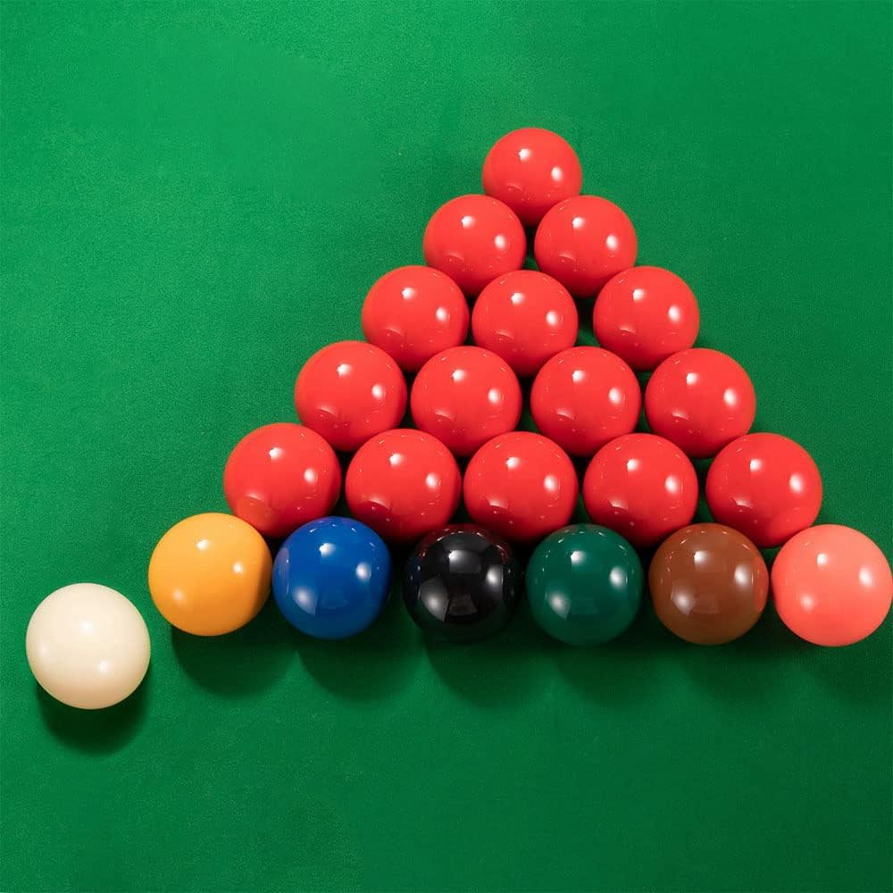
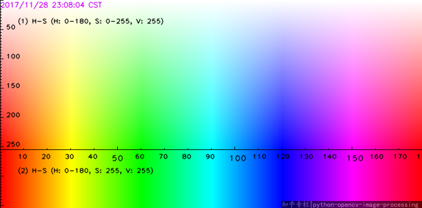

- Használt nyelv: python
- Fontosabb könyvtárak:
	- cv2 (opencv) - videó feldolgozási eszközök
	- numpy - matematikai műveletekhez
	- tensorflow - gépi tanulás alapú objektumfelismerés (nem feltétlen igényli a feladat)
## Koncepció:
- csak felülnézetből: framenként szegmentációs technikával elkülöníteni a golyókat
	- a zöld háttér (asztal) lehetővé teszi ennek a könnyebb végrehajtását
	- hsv színtérbe konvertálást használunk

A Snooker labdákat színeik alapján azonosíthatjuk, ha a színképüket hibaértékek közé szorítjuk.


Például a piros labdákra:
```python
lower_red = (0, 120, 70) 
upper_red = (10, 255, 255) 
mask1 = cv2.inRange(hsv, lower_red, upper_red)   # 0–10 hue

lower_red2 = (170, 120, 70) 
upper_red2 = (180, 255, 255) 
mask2 = cv2.inRange(hsv, lower_red2, upper_red2)   # 170–180 hue

red_mask = mask1 | mask2
```

*2 mask a piros esetén a HSV színtér színegyenesének határai miatt kellenek:*


A cv2-es könyvtár **Hough Circle Transform** technikát használó. HoughCircles metódusa alkalmas a labdák felismerésére:
```python
circles = cv2.HoughCircles(     red_mask, cv2.HOUGH_GRADIENT, dp=1.2, minDist=20, param1=50, param2=30, minRadius=8, maxRadius=15 )
```
Ezzel megkapjuk a labdák pozícióját és átmérőjét.

A cv2 tackereit (követőit) használva számontartjuk a labdák mozgását (megtaláljuk a legközelebbi detektált pozíciót a framek között).

Ezeket egy tömbbe gyűjtjük, ezáltal számontartjuk a látható labdákat. Ha egy labda eltűnt a tömbből, akkor belökték, így meghatározhatjuk melyik játékos szerzett pontot.

___
## Prototípus:
Egy felülnézetes videón dolgozunk:
***Videó helye***
1. Megnyitjuk a videót
2. **HSV** színtérbe konvertáljuk a frameket
3. Szegmentáljuk a labdákat és egy listában, vagy tömbben tároljuk őket
4. Tároljuk a pontszámokat amíg minden labda el nem fogy